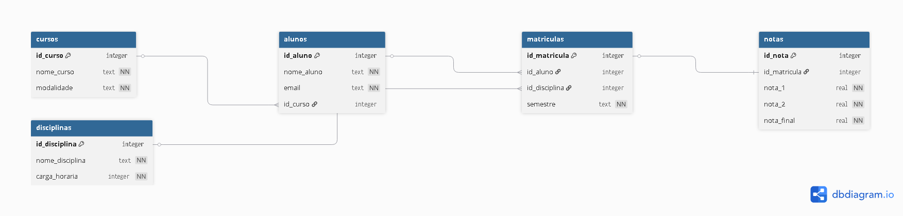

# Diagrama textual do banco

cursos
- id_curso PK
- nome_curso
- modalidade

alunos
- id_aluno PK
- nome_aluno
- email
- id_curso FK

disciplinas
- id_disciplina PK
- nome_disciplina
- carga_horaria

matriculas
- id_matricula PK
- id_aluno FK
- id_disciplina FK
- semestre

notas
- id_nota PK
- id_matricula FK
- nota_1
- nota_2
- nota_final